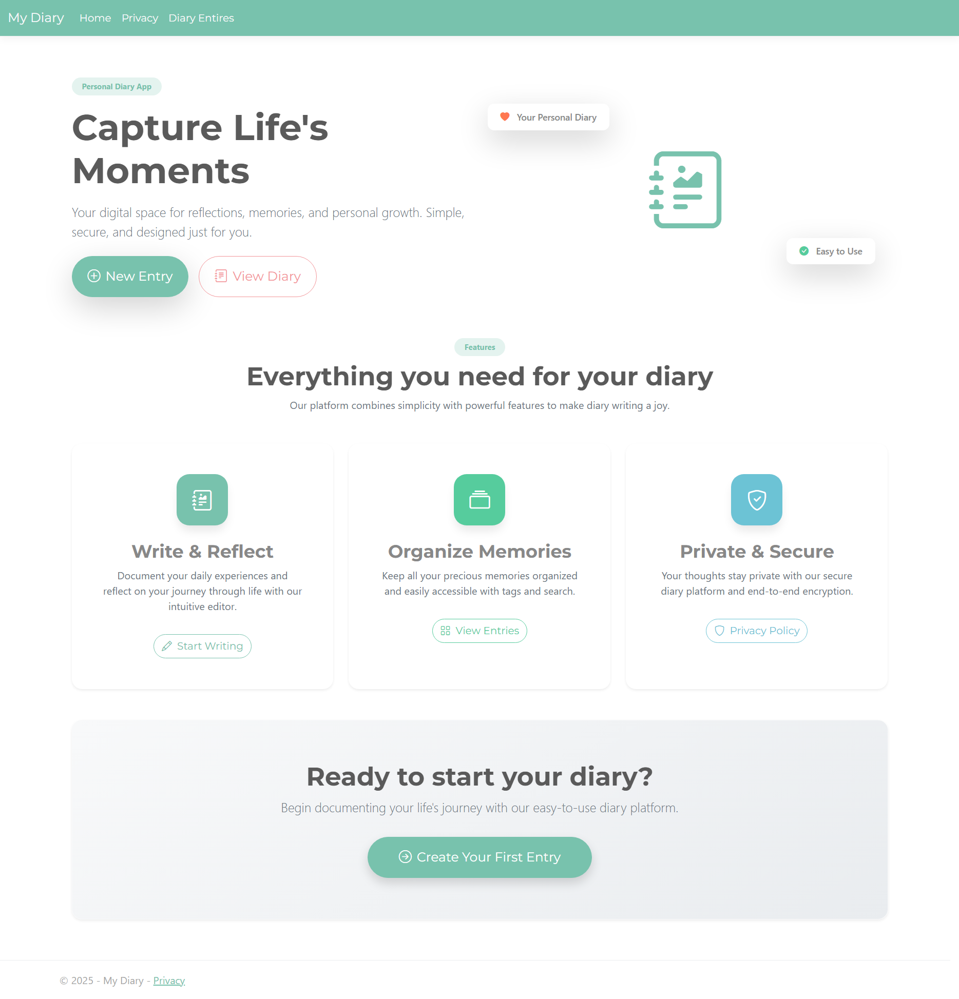
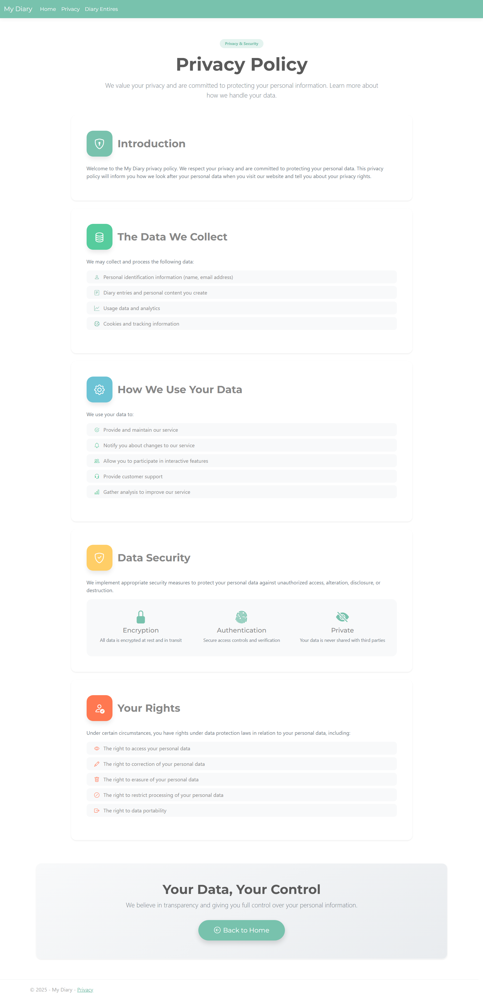
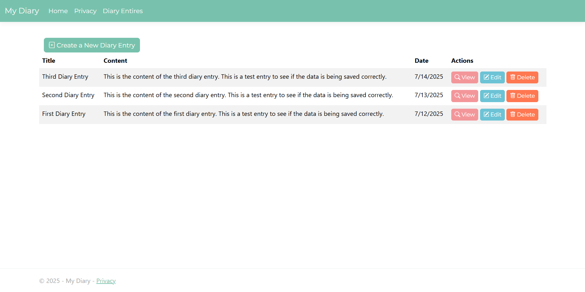
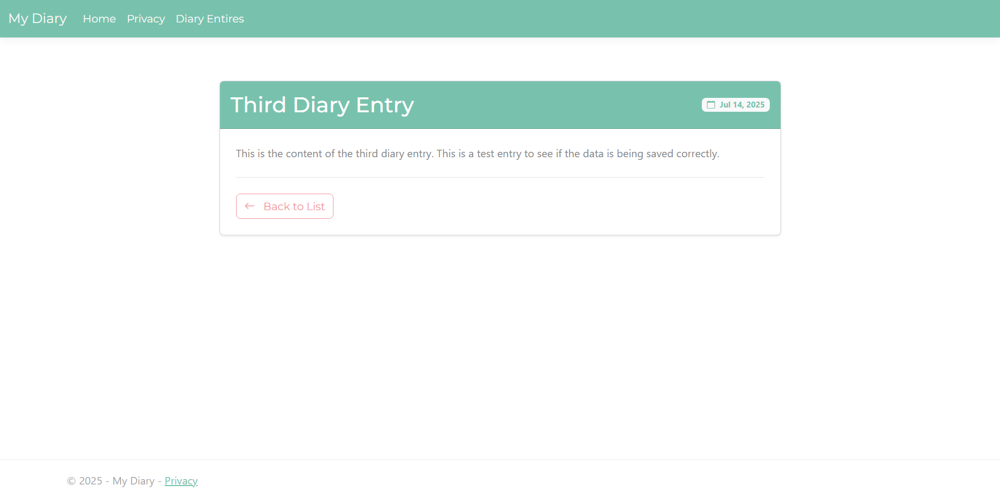
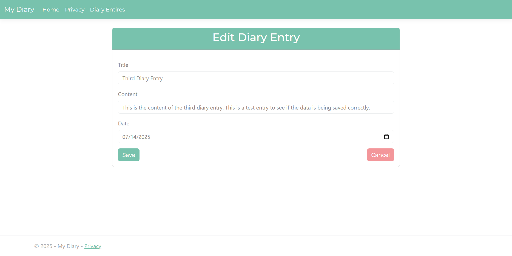
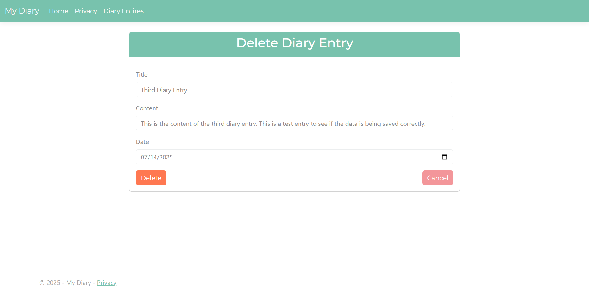

# Diary App

A simple personal diary application built with ASP.NET Core MVC. Write, organize, and manage your daily thoughts and memories.

## Screenshots









## Features

- Create, read, update, and delete diary entries
- Clean and responsive interface
- Secure data storage with SQL Server

## Tech Stack

- ASP.NET Core MVC
- SQL Server
- Entity Framework Core
- Bootstrap 5
- Bootstrap Icons

## Setup

1. Clone the repository
```bash
git clone https://github.com/ilkeozs/Diary.git
cd Diary/DiaryApp
```

2. Update connection string in `appsettings.json`

3. Run migrations
```bash
dotnet ef database update
```

4. Start the application
```bash
dotnet run
```

## Usage

- Navigate to the home page
- Click "New Entry" to create your first diary entry
- View all entries from the "View Diary" page
- Edit or delete entries as needed

## License

MIT License
